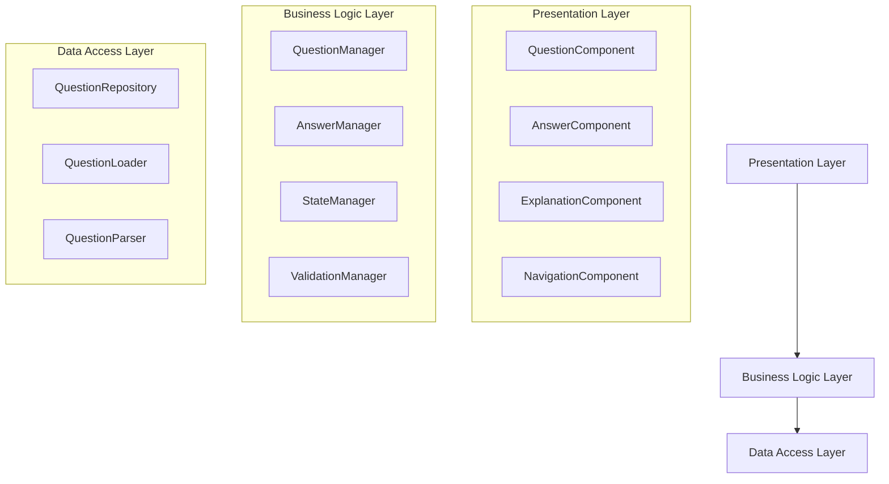

# Design Document

## Overview

This design document outlines the architecture for rebuilding the C# technical interview revision webapp using Object-Oriented Programming principles and SOLID design patterns. The application will be built with TypeScript and React, implementing a clean separation of concerns through well-defined interfaces and classes.

The architecture follows a layered approach with clear boundaries between presentation, business logic, and data access layers. Each component has a single responsibility and depends on abstractions rather than concrete implementations.

## Architecture

### High-Level Architecture



### SOLID Principles Implementation

**Single Responsibility Principle (SRP):**
- Each class has one reason to change
- QuestionManager handles question logic only
- AnswerManager handles answer validation only
- StateManager handles application state only

**Open/Closed Principle (OCP):**
- Interfaces allow extension without modification
- New question types can be added via IQuestion implementations
- New validation rules via IValidator implementations

**Liskov Substitution Principle (LSP):**
- All implementations can replace their interfaces
- Question types are interchangeable through IQuestion
- Validators are interchangeable through IValidator

**Interface Segregation Principle (ISP):**
- Small, focused interfaces
- IQuestionRepository vs IQuestionLoader vs IQuestionValidator
- Components depend only on methods they use

**Dependency Inversion Principle (DIP):**
- High-level modules depend on abstractions
- Concrete implementations injected via dependency injection
- Business logic independent of data source details

## Components and Interfaces

### Core Interfaces

```typescript
// Domain Models
interface IQuestion {
  readonly id: string;
  readonly text: string;
  readonly codeExample?: ICodeExample;
  readonly options: IOption[];
  readonly category: string;
  readonly difficulty: QuestionDifficulty;
  readonly explanation: string;
  getCorrectAnswers(): number[];
  hasMultipleCorrectAnswers(): boolean;
}

interface ICodeExample {
  readonly code: string;
  readonly language: string;
  readonly output?: string;
}

interface IOption {
  readonly id: string;
  readonly text: string;
  readonly explanation?: string;
}

// Business Logic Interfaces
interface IQuestionManager {
  getCurrentQuestion(): IQuestion | null;
  moveToNext(): boolean;
  moveToPrevious(): boolean;
  resetCurrent(): void;
  getTotalCount(): number;
  getCurrentIndex(): number;
}

interface IAnswerManager {
  submitAnswer(questionId: string, selectedOptions: number[]): IAnswerResult;
  getAnswerState(questionId: string): IAnswerState | null;
  resetAnswer(questionId: string): void;
}

interface IStateManager {
  getApplicationState(): IApplicationState;
  updateQuestionState(questionId: string, state: IQuestionState): void;
  resetApplicationState(): void;
}

// Data Access Interfaces
interface IQuestionRepository {
  loadQuestions(): Promise<IQuestion[]>;
  getQuestionById(id: string): Promise<IQuestion | null>;
  getQuestionsByCategory(category: string): Promise<IQuestion[]>;
}

interface IQuestionLoader {
  loadFromJson(filePath: string): Promise<RawQuestionData[]>;
}

interface IQuestionParser {
  parseQuestions(rawData: RawQuestionData[]): IQuestion[];
  parseQuestion(rawQuestion: RawQuestionData): IQuestion;
}

// Validation Interfaces
interface IAnswerValidator {
  validate(question: IQuestion, selectedAnswers: number[]): IValidationResult;
}

interface IQuestionValidator {
  validateQuestion(question: IQuestion): IValidationResult;
}
```

### Core Classes

```typescript
// Domain Models
class MultipleChoiceQuestion implements IQuestion {
  constructor(
    private readonly _id: string,
    private readonly _text: string,
    private readonly _options: IOption[],
    private readonly _correctAnswers: number[],
    private readonly _explanation: string,
    private readonly _category: string,
    private readonly _difficulty: QuestionDifficulty,
    private readonly _codeExample?: ICodeExample
  ) {}

  get id(): string { return this._id; }
  get text(): string { return this._text; }
  get options(): IOption[] { return [...this._options]; }
  get category(): string { return this._category; }
  get difficulty(): QuestionDifficulty { return this._difficulty; }
  get explanation(): string { return this._explanation; }
  get codeExample(): ICodeExample | undefined { return this._codeExample; }

  getCorrectAnswers(): number[] {
    return [...this._correctAnswers];
  }

  hasMultipleCorrectAnswers(): boolean {
    return this._correctAnswers.length > 1;
  }
}

class CodeExample implements ICodeExample {
  constructor(
    private readonly _code: string,
    private readonly _language: string,
    private readonly _output?: string
  ) {}

  get code(): string { return this._code; }
  get language(): string { return this._language; }
  get output(): string | undefined { return this._output; }
}

class Option implements IOption {
  constructor(
    private readonly _id: string,
    private readonly _text: string,
    private readonly _explanation?: string
  ) {}

  get id(): string { return this._id; }
  get text(): string { return this._text; }
  get explanation(): string | undefined { return this._explanation; }
}

// Business Logic Classes
class QuestionManager implements IQuestionManager {
  private currentIndex: number = 0;

  constructor(
    private readonly questionRepository: IQuestionRepository,
    private questions: IQuestion[] = []
  ) {}

  async initialize(): Promise<void> {
    this.questions = await this.questionRepository.loadQuestions();
  }

  getCurrentQuestion(): IQuestion | null {
    return this.questions[this.currentIndex] || null;
  }

  moveToNext(): boolean {
    if (this.currentIndex < this.questions.length - 1) {
      this.currentIndex++;
      return true;
    }
    return false;
  }

  moveToPrevious(): boolean {
    if (this.currentIndex > 0) {
      this.currentIndex--;
      return true;
    }
    return false;
  }

  resetCurrent(): void {
    // Reset handled by AnswerManager
  }

  getTotalCount(): number {
    return this.questions.length;
  }

  getCurrentIndex(): number {
    return this.currentIndex;
  }
}

class AnswerManager implements IAnswerManager {
  constructor(
    private readonly validator: IAnswerValidator,
    private readonly stateManager: IStateManager
  ) {}

  submitAnswer(questionId: string, selectedOptions: number[]): IAnswerResult {
    const question = this.getQuestionById(questionId);
    if (!question) {
      throw new Error(`Question with id ${questionId} not found`);
    }

    const validationResult = this.validator.validate(question, selectedOptions);
    const answerResult: IAnswerResult = {
      isCorrect: validationResult.isValid,
      correctAnswers: question.getCorrectAnswers(),
      explanation: question.explanation,
      selectedAnswers: selectedOptions
    };

    const questionState: IQuestionState = {
      selectedAnswers: selectedOptions,
      isSubmitted: true,
      isCorrect: validationResult.isValid,
      submittedAt: new Date()
    };

    this.stateManager.updateQuestionState(questionId, questionState);
    return answerResult;
  }

  getAnswerState(questionId: string): IAnswerState | null {
    const appState = this.stateManager.getApplicationState();
    return appState.questionStates.get(questionId) || null;
  }

  resetAnswer(questionId: string): void {
    const resetState: IQuestionState = {
      selectedAnswers: [],
      isSubmitted: false,
      isCorrect: false,
      submittedAt: undefined
    };
    this.stateManager.updateQuestionState(questionId, resetState);
  }

  private getQuestionById(questionId: string): IQuestion | null {
    // Implementation depends on how questions are accessed
    // Could be injected as a dependency
    return null;
  }
}
```

## Data Models

### Question Data Structure

The application will maintain compatibility with the existing JSON format while providing a clean object-oriented interface:

```typescript
// Raw JSON structure (existing format)
interface RawQuestionData {
  id: string;
  question: string;
  type: string;
  options: Array<{
    id: string;
    text: string;
    explanation?: string;
  }>;
  correctAnswerIndex?: number;
  correctAnswerIndices?: number[];
  explanation: string;
  codeExample?: {
    language: string;
    code: string;
    output?: string;
  };
  category: string;
  subcategory?: string;
  difficulty: number;
  tags: string[];
}

// Application state models
interface IApplicationState {
  currentQuestionIndex: number;
  questions: IQuestion[];
  questionStates: Map<string, IQuestionState>;
  isInitialized: boolean;
}

interface IQuestionState {
  selectedAnswers: number[];
  isSubmitted: boolean;
  isCorrect: boolean;
  submittedAt?: Date;
}

interface IAnswerResult {
  isCorrect: boolean;
  correctAnswers: number[];
  explanation: string;
  selectedAnswers: number[];
}

interface IValidationResult {
  isValid: boolean;
  errors: string[];
}

type QuestionDifficulty = 'easy' | 'medium' | 'hard';
```

## Error Handling

### Error Hierarchy

```typescript
abstract class ApplicationError extends Error {
  abstract readonly code: string;
  abstract readonly statusCode: number;
}

class QuestionNotFoundError extends ApplicationError {
  readonly code = 'QUESTION_NOT_FOUND';
  readonly statusCode = 404;
  
  constructor(questionId: string) {
    super(`Question with id ${questionId} not found`);
  }
}

class ValidationError extends ApplicationError {
  readonly code = 'VALIDATION_ERROR';
  readonly statusCode = 400;
  
  constructor(message: string, public readonly validationErrors: string[]) {
    super(message);
  }
}

class DataLoadError extends ApplicationError {
  readonly code = 'DATA_LOAD_ERROR';
  readonly statusCode = 500;
  
  constructor(source: string, cause?: Error) {
    super(`Failed to load data from ${source}`);
    this.cause = cause;
  }
}
```

### Error Handling Strategy

```typescript
interface IErrorHandler {
  handleError(error: Error): void;
  canHandle(error: Error): boolean;
}

class ApplicationErrorHandler implements IErrorHandler {
  canHandle(error: Error): boolean {
    return error instanceof ApplicationError;
  }

  handleError(error: Error): void {
    if (error instanceof ApplicationError) {
      console.error(`[${error.code}] ${error.message}`);
      // Handle specific error types
      switch (error.code) {
        case 'QUESTION_NOT_FOUND':
          this.handleQuestionNotFound(error as QuestionNotFoundError);
          break;
        case 'VALIDATION_ERROR':
          this.handleValidationError(error as ValidationError);
          break;
        case 'DATA_LOAD_ERROR':
          this.handleDataLoadError(error as DataLoadError);
          break;
      }
    }
  }

  private handleQuestionNotFound(error: QuestionNotFoundError): void {
    // Navigate to first question or show error message
  }

  private handleValidationError(error: ValidationError): void {
    // Show validation errors to user
  }

  private handleDataLoadError(error: DataLoadError): void {
    // Show loading error and retry option
  }
}
```

## Testing Strategy

### Unit Testing Approach

```typescript
// Example test structure for QuestionManager
describe('QuestionManager', () => {
  let questionManager: QuestionManager;
  let mockRepository: jest.Mocked<IQuestionRepository>;
  let mockQuestions: IQuestion[];

  beforeEach(() => {
    mockRepository = createMockQuestionRepository();
    mockQuestions = createMockQuestions();
    mockRepository.loadQuestions.mockResolvedValue(mockQuestions);
    questionManager = new QuestionManager(mockRepository);
  });

  describe('getCurrentQuestion', () => {
    it('should return null when no questions loaded', () => {
      const result = questionManager.getCurrentQuestion();
      expect(result).toBeNull();
    });

    it('should return first question after initialization', async () => {
      await questionManager.initialize();
      const result = questionManager.getCurrentQuestion();
      expect(result).toBe(mockQuestions[0]);
    });
  });

  describe('moveToNext', () => {
    it('should move to next question when available', async () => {
      await questionManager.initialize();
      const result = questionManager.moveToNext();
      expect(result).toBe(true);
      expect(questionManager.getCurrentIndex()).toBe(1);
    });

    it('should return false when at last question', async () => {
      await questionManager.initialize();
      // Move to last question
      for (let i = 0; i < mockQuestions.length - 1; i++) {
        questionManager.moveToNext();
      }
      const result = questionManager.moveToNext();
      expect(result).toBe(false);
    });
  });
});

// Integration testing approach
describe('Question Flow Integration', () => {
  let app: Application;

  beforeEach(async () => {
    app = await createTestApplication();
  });

  it('should complete full question answering flow', async () => {
    // Load question
    const question = await app.questionManager.getCurrentQuestion();
    expect(question).toBeDefined();

    // Submit answer
    const result = await app.answerManager.submitAnswer(
      question!.id, 
      [0]
    );
    expect(result.isCorrect).toBeDefined();

    // Move to next question
    const moved = app.questionManager.moveToNext();
    expect(moved).toBe(true);
  });
});
```

### Component Testing Strategy

```typescript
// React component testing with proper mocking
describe('QuestionComponent', () => {
  let mockQuestionManager: jest.Mocked<IQuestionManager>;
  let mockAnswerManager: jest.Mocked<IAnswerManager>;

  beforeEach(() => {
    mockQuestionManager = createMockQuestionManager();
    mockAnswerManager = createMockAnswerManager();
  });

  it('should render question text and options', () => {
    const mockQuestion = createMockQuestion();
    mockQuestionManager.getCurrentQuestion.mockReturnValue(mockQuestion);

    render(
      <QuestionComponent 
        questionManager={mockQuestionManager}
        answerManager={mockAnswerManager}
      />
    );

    expect(screen.getByText(mockQuestion.text)).toBeInTheDocument();
    mockQuestion.options.forEach(option => {
      expect(screen.getByText(option.text)).toBeInTheDocument();
    });
  });

  it('should handle answer submission', async () => {
    const mockQuestion = createMockQuestion();
    mockQuestionManager.getCurrentQuestion.mockReturnValue(mockQuestion);
    mockAnswerManager.submitAnswer.mockResolvedValue(createMockAnswerResult());

    render(
      <QuestionComponent 
        questionManager={mockQuestionManager}
        answerManager={mockAnswerManager}
      />
    );

    // Select option and submit
    const option = screen.getByText(mockQuestion.options[0].text);
    fireEvent.click(option);
    
    const submitButton = screen.getByText('Submit');
    fireEvent.click(submitButton);

    await waitFor(() => {
      expect(mockAnswerManager.submitAnswer).toHaveBeenCalledWith(
        mockQuestion.id,
        [0]
      );
    });
  });
});
```

This design provides a solid foundation for rebuilding the application with proper OOP principles, clear separation of concerns, and comprehensive testing strategies. The architecture is extensible and maintainable while meeting all the specified requirements.